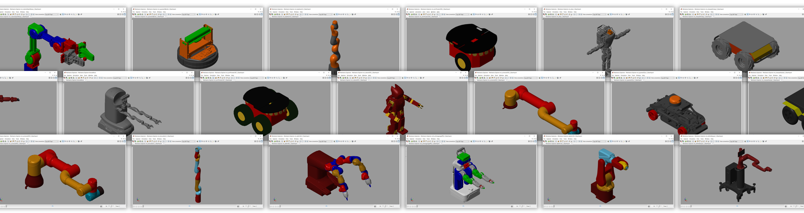

# **Industrial Robot Models in Simscape**
Copyright 2023 The MathWorks, Inc.

View on File Exchange:   
You can also open in MATLAB Online: 

This repository of industrial robot models for use with [Simscape Multibody](https://www.mathworks.com/products/simscape-multibody.html) includes mobile and manipulator robots. It has examples that help you:

* **Import URDF files** using MATLAB to create models
* Perform **kinematic and dynamic analyses**
* Integrate **electric drives and control algorithms** in [Simulink](https://www.mathworks.com/products/simulink.html)
* Leverage Robotics System Toolbox for **[path and trajectory planning](https://www.mathworks.com/products/robotics.html#robalg)**.

Run file startup_sm_industrial_robots.m to get started.

To learn more about modeling and simulation with Simscape, please visit:
* [Simscape Getting Started Resources](https://www.mathworks.com/solutions/physical-modeling/resources.html)
* Product Capabilities:
   * [Simscape](https://www.mathworks.com/products/simscape.html)
   * [Simscape Battery](https://www.mathworks.com/products/simscape-battery.html)
   * [Simscape Driveline](https://www.mathworks.com/products/simscape-driveline.html)
   * [Simscape Electrical](https://www.mathworks.com/products/simscape-electrical.html)
   * [Simscape Fluids](https://www.mathworks.com/products/simscape-fluids.html)
   * [Simscape Multibody](https://www.mathworks.com/products/simscape-multibody.html)
